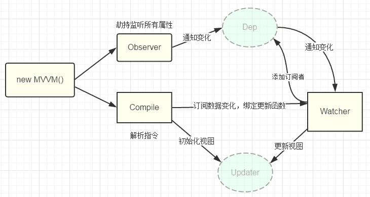

# 浅谈Vue源码

摘自 `https://github.com/muwoo/blogs/blob/master/src/Vue` 


## 准备知识

`[].slice.call(lis)`

- 将伪数组转化为真数组
- slice()方法 返回一个从开始到结束选择的数组的一部分 浅拷贝到一个新数组。
- call： 让一个函数 成为指定对象的方法来进行调用
- 对象属性找的是原型链

`node.nodeType`

- 得到节点类型

节点

- document文档
- element元素
- attr属性节点
- text文本节点

`Object.keys(obj)`

- 得到 对象 自身可枚举属性组成的数组

`obj.hasOwnProperty(prop)`

- 判断prop是否为obj自身的属性

`DocumentFragment`

- 文档碎片
- 也是节点
- document对应显示的页面,包含n个element. 一旦更新document内部的某个元素界面会更新
- 解决: 高效批量更新多个节点
- 内存中保存 n个element的容器对象,不与界面关联.
- 更新 fragment中的某个element, 界面不会更新


当前断点所管理的区域全部执行完

执行完当前行的语句 进入下一行

进入断点所在的函数去执行

将所在的函数体的函数全部执行完并退出函数体

## 1.数据代理

通过一个对象代理 对另一个对象代理 中的属性的操作

vue数据代理: 通过vm对象【new Vue】来 代理data对象中 所有属性的操作

 好处: 更方便的操作 data 中的数据

通过 `getter` 和 `setter` 来实现

```
vm = new Vue({
	el: ,
	data:{
		name: "feifei"
	}
})
console.log(vm._data. name)
console.log(vm.name)
```

### 1.1基本实现流程

1. 通过 Object.defineProperty()给 vm 添加与 data 对象的属性对应的属性描述符
2. 所有添加的属性都包含 getter/setter
3. getter/setter 内部去操作 data 中对应的属性数据


## 2.模板解析

> 模板：html 嵌套了 js代码

### 2.1基本流程

1. 将 el 的所有子节点取出, 添加到一个新建的文档 fragment 对象中
   1. 创建空的 fragment容器对象
   2. 将el元素中所有子节点转移到 fragment
   3. 返回 fragment
2. 对 fragment 中的所有层次子节点递归进行编译解析处理
   - 对大括号表达式文本节点进行解析
   - 对元素节点的指令属性进行解析
     - 事件指令解析
     - 一般指令解析
3. 将解析后的 fragment 添加到 el 中显示

#### 2.1.1大括号表达式解析

1. 根据正则对象得到匹配出的表达式字符串: 子匹配/RegExp.$1 name
2. 从 data 中取出表达式对应的属性值
3. 将属性值设置为文本节点的 textContent

#### 2.1.2事件指令解析

1. 从指令名中取出事件名
2. 根据指令的值(表达式)从 methods 中得到对应的事件处理函数对象
3. 给当前元素节点绑定指定事件名和回调函数的 dom 事件监听
4. 指令解析完后, 移除此指令属性

#### 2.1.3一般指令解析

1. 得到指令名和指令值(表达式) text/html/class msg/myClass
2. 从 data 中根据表达式得到对应的值
3. 根据指令名确定需要操作元素节点的什么属性
   - v-text---textContent 属性
   - v-html---innerHTML 属性
   - v-class--className 属性
4. 将得到的表达式的值设置到对应的属性上
5. 移除元素的指令属性


updater包含多个更新节点方法的工具对象

compileUtil包含多个解析指令方法的工具对象

- 具体如何解析 需要查看 bind
  1. 得到更新节点的函数
  2. 调用函数更新节点


## 3.数据绑定

### 3.1数据绑定

一旦更新了 **data** 中的某个属性数据, 所有界面上直接使用或间接使用了此属性的节点都会
更新

从操作 DOM元素 变成了 操作数据

`Object.defineProperty()实现getter和setter属性`

### 3.2数据劫持

> 数据劫持是 vue 中用来实现 数据绑定 的一种技术

- 基本思想: 通过 defineProperty()来监视 **data** 中所有属性(任意层次)数据的变化, 一旦变
  化就去更新界面

### 3.3四个重要对象

#### 3.3.1Observer

- 用来对 data 所有属性数据进行劫持的构造函数
- 给 data 中所有属性重新定义属性描述(get/set)
- 为 data 中的每个属性创建对应的 dep 对象


#### 3.3.2Dep(Depend)

- 它的实例什么时候创建？
  - 初始化的给 data的属性进行数据劫持的时候创建

- Dep创建的个数

  - data 中的每个属性(所有层次) 对应一个 dep 对象

- 创建的时机:
  - 在初始化 define data 中各个属性时创建对应的 dep 对象
  - 在 data 中的某个属性值被设置为新的对象时

- 对象的结构

  ```
  {
  	id, // 每个 dep 都有一个唯一的 id
  	subs //包含 n 个对应 watcher 的数组(subscribes 的简写)
  }
  ```

- subs 属性说明

  - 当 watcher 被创建时, 内部将当前 watcher 对象添加到对应的 dep 对象的 subs 中
  - 当此 data 属性的值发生改变时, subs 中所有的 watcher 都会收到更新的通知,从而最终更新对应的界面


#### 3.3.3Compiler

- 用来解析模板页面的对象的构造函数(一个实例)
- 利用 compile 对象解析模板页面
- 每解析一个表达式(非事件指令)都会创建一个对应的 watcher 对象, 并建立 watcher
  与 dep 的关系
- complie 与 watcher 关系: 一对多的关系


#### 3.3.4Watcher

- 监视当前表达式数据的变化 

- 实例创建时间
  - 初始化的解析 大括号表达式/一般指令 时创建【初始化编译模板时】
- 创建的个数
  - 与 模板中表达式(不包含事件指令) 一一对应

- 对象的组成：

  ```
  {
  	cb, //当表达式所对应的数据发生改变的回调函数，用于更新界面
  	vm, //vm 对象
  	exp, //对应指令的表达式
  	value, //表达式当前的值
  	depIds //表达式中各级属性所对应的 dep 对象的集合对象
  			//属性名为 dep 的 id, 属性值为 dep
  }
  ```


#### 3.3.5Dep与Watcher 的关系

- 关系

  - 多对多

  - data中一个属性对应一个 dep, 一个 dep 中对应 n 个 watcher
    - n>1： 模板中有几个表达式使用到了同一个属性 `{{a}}/v-text="a"`
  - 模板中一个非事件表达式对应一个 watcher, 一个 watcher 中可对应n个 dep
    - n>1： 多层表达式: a.b...

- 怎么建立关系

  - `Object.defineProperty()`中的 get方法来建立关系
  - 建立关系发生在 创建Watcher的时候
  - Dep是在`observer(data, this);`时创建
  - Watcher是在 解析模板时创建
  - 当前的Watcher 关联到 Dep上去： `Dep.target = this`

- 数据绑定使用到 2 个核心技术
  - defineProperty()
  - 消息订阅与发布


## 4.双向数据绑定

- 双向数据绑定是建立在单向数据绑定(model==>View)的基础之上的
- 双向数据绑定的实现流程:
  - 在解析 v-model 指令时, 给当前元素添加 input 监听
  - 当 input 的 value 发生改变时, 将最新的值赋值给当前表达式所对应的 data 属性


## 5.MVVM原理图

