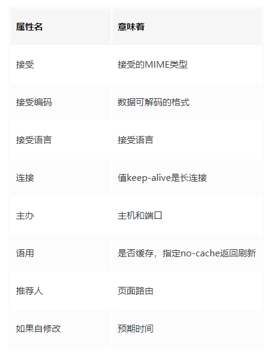

# **1.函数**

## **1.1函数定义**

### 1.1.1函数声明

```
//ES5
function getSum(){}
function (){}//匿名函数
//ES6
()=>{}
```

### 1.1.2函数表达式(函数字面量)

```
//ES5
var sum=function(){}
//ES6
let sum=()=>{}
```

### 1.1.3构造函数

```
const sum = new Function('a', 'b' , 'return a + b')
```

### 1.1.4三种方法的对比

1. 函数声明有预解析，**优先级：**函数声明 > 函数字面量；
2. 构造函数定义函数的方式是一个函数表达式，这种方式会导致解析两次代码，影响性能。
   - 第一次解析常规的JavaScript代码
   - 第二次解析重构构造函数的字符串

## **1.2ES5中函数调用**

> **this的几种情况**
>
> - 普通函数中的 this --- window
>- 构造函数中的 this --- 当前构造函数创建的对象
> - 方法中的 this --- 方法所属的对象
> - 事件处理函数中的 this --- 事件源，谁调用该事件 this就指向谁

### 1.2.1函数调用模式

> 包括`函数名()`和 匿名函数 ，`this` 指向窗口

```
function getSum() {
	console.log(this) // 这个属于函数名调用，this指向window 
} 
getSum()  

var getSum=function() {
	console.log(this) // 实际上也是函数名调用，window 
}
getSum()

(function() {
	console.log(this) //匿名函数调用，this指向window 
})()
```

### **1.2.2方法调用**

```
var objList = {
	name: 'methods',
	getSum: function() {
		console.log(this) //指向 objList对象
		}
	}
objList.getSum()
```

### **1.2.3构造器调用**

```
function Person() {
	console.log(this); //是构造函数调用，指向实例化的对象personOne
	}
var personOne = new Person();
```

## **1.3 ES6中函数的调用**

```
(() => {   
	console.log(this) //window
})()

let arrowFun = () => {
	console.log(this)//window
}
arrowFun()

let arrowObj = {
	arrFun: function() {
		(() => {
			console.log(this)//this指向的是arrowObj对象
		})()
	}
}
arrowObj.arrFun();
```

## **1.4call，apply和bind**

使用 apply、call、bind 函数也是可以改变 this 的指向的

### 1.4.1apply

> 语法: `fun.apply(thisArg, [argsArray])`
>
> - thisArg：在 fun 函数运行时指定的 this 值。
>   - 指定的 this 值并不一定是该函数执行时真正的 this 值，如果这个函数处于非严格模式下，
>     - 如果第一个参数 指定为 null 或 undefined 时会自动指向全局对象（浏览器中就是window对象）
>     - 如果第一个参数 值为原始值（数字，字符串，布尔值）的 this 会指向该原始值的自动包装对象。
> - argsArray：一个数组或者类数组对象，其中的数组元素将作为单独的参数传给 fun 函数。如果该参数的值为null 或 undefined，则表示不需要传入任何参数。从ECMAScript 5 开始可以使用类数组对象。

```javascript
 var a = {
     name : "Cherry",
     func1: function () {
         console.log(this.name)
     },
     func2: function () {
         setTimeout(  function () {
             this.func1()
         }.apply(a),100);
     }
};
a.func2()            // Cherry
```

### 1.4.2call

> 语法: `fun.call(thisArg[, arg1[, arg2[, ...]]])`

```javascript
var a = {
    name : "Cherry",
    func1: function () {
        console.log(this.name)
    },
    func2: function () {
        setTimeout(  function () {
            this.func1()
        }.call(a),100);
    }
};
a.func2()            // Cherry
```

### 1.4.3bind

>bind()方法创建一个新的函数,
>
>当被调用时，将其this关键字设置为提供的值，在调用新函数时，在任何提供之前提供一个给定的参数序列。

```javascript
var a = {
    name : "Cherry",
    func1: function () {
        console.log(this.name)
    },
    func2: function () {
        setTimeout(  function () {
            this.func1()
        }.bind(a),100);
    }
};
a.func2()            // Cherry
```

### 1.4.4apply、call区别

> 用法基本类似,它们的区别只是 传入参数的不同
>
>  apply 和 call 的区别是 call 方法接受的是若干个参数列表，而 apply 接收的是一个包含多个参数的数组。


## **1.5函数的节流和防抖**


函数的防抖与节流 都是防止函数被多次调用，在时间轴上 控制函数的执行次数

### 1.5.1防抖

> 事件在触发n秒后再执行回调，
>
> 如果在这n秒内又被触发，则重新计时，先计算时间后执行

生活实例: 有人进入电梯，电梯则在10秒后自动关门，如果10秒内又有人进入电梯，则电梯重新计时，自动关门。

#### 实现

```
function debounce(fn, delayTime) {
    let timer = null
    return function (args) {
        if (timer) {
            timer = null
            clearTimeout(timer)
        }
        let _this = this
        let _args = args
        timer = setTimeout(function () {
            fn.call(_this, _args)
        }, delayTime)
    }
}

let inputDom = document.getElementById('input2')

inputDom.addEventListener('keyup', debounce((e) => {console.log(e.target.value)}, 1000))
```

#### **原理**

防抖是通过在用户没有操作的情况下，如果在等待时间内用户没有操作，则执行回调，如果有操作，继续等待相应时间间隔。

所以在闭包函数内，初始化一个时间参数timer，如果timer为空，则表示回调事件没执行或者已执行完毕，代表在等待时间内用户没有操作，相反，如果timer不为null，清空timer，重新计时。

#### 场景

监听窗口的滚动，缩放。高频发生的一些事件；

### 1.5.2节流

> n秒内回调函数只会被执行一次，先执行后计算。

生活实例: 玩飞机大战时，点击屏幕连发子弹，即使点击屏幕的频率再快，子弹也是平均间隔时间发射。

#### 实现

##### setTimeout

```
function throttle(fn, wait) {
    var timer = null
    if (timer) return 
    return function() {
        let _this = this 
        let args = arguments
        timer = setTimeout(function() {
            fn.apply(_this, args) timer = null
        },
        wait)
    }
}
```

##### 时间差

```
function throttle(fn, wait) {
    var lastTime = 0
    return function() {
        let _this = this 
        let args = arguments 
        let nowTime = new Date() 
        if (nowTime - lastTime > wait) {
            fn.apply(_this, args) lastTime = nowTime
        }
    }
}
```

#### 原理

节流目的是为了让函数在特定时间内执行一次，这也是setTimeout的设计初衷。

所以可以直接用setTimeout实现，当然执行完回调一定要将timer置空。

另外一种思路就是计算触发时间和执行时间的差值，大于再执行回调。

#### 场景

涉及与后端交互的按钮，由于网络原因或者其他原因，导致接口没有返回值，用户一直点点点的问题。

## **1.6原型链**

### 1.6.1构造函数，实例与原型对象的关系


```
var Person = function (name) { this.name = name; }//Person是构造函数
var o3personTwo = new Person('personTwo')//personTwo是实例
```


```
实例对象 = new 构造函数
```

- 构造函数[ `Object` ] --- 原型[ `Object.prototype` ]
  - prototype
  - constructor
- 实例对象 --- 原型
  - `__proto__`

### 1.6.2实例对象、原型与属性的关系

1. 实例对象 找不到 属性后
2. 会从原型中去查找 该属性

## **1.7继承的方式**

JS 是一门弱类型动态语言，封装和继承是他的两大特性

### 1.7.1原型链继承

> 优缺点简单容易实现，但是要想为子类添加属性和方法，必须要在new Animal（）这样的语句之后执行，无法实现多继承

将父类的实例作为子类的原型

代码实现定义父类：

```
// 定义一个动物类
function Animal (name) {
  // 属性
  this.name = name || 'Animal';
  // 实例方法
  this.sleep = function(){
    console.log(this.name + '正在睡觉！');
  }
}
// 原型方法
Animal.prototype.eat = function(food) {
  console.log(this.name + '正在吃：' + food);
};
```

子类：

```
function Cat(){ 
}
Cat.prototype = new Animal();
Cat.prototype.name = 'cat';

//&emsp;Test Code
var cat = new Cat();
console.log(cat.name);//cat
console.log(cat.eat('fish'));//cat正在吃：fish  undefined
console.log(cat.sleep());//cat正在睡觉！undefined
console.log(cat instanceof Animal); //true 
console.log(cat instanceof Cat); //truefunction Cat(){ }Cat.prototype = new Animal();Cat.prototype.name = 'cat';//&emsp;Test Codevar cat = new Cat();console.log(cat.name);//catconsole.log(cat.eat('fish'));//cat正在吃：fish  undefinedconsole.log(cat.sleep());//cat正在睡觉！undefinedconsole.log(cat instanceof Animal); //true console.log(cat instanceof Cat); //true
```

### **1.7.2构造继承**

> 优缺点可以实现多继承，不能继承原型属性/方法

本质是利用call来改变Cat中的这一指标1.代码实现子类：

```
function Cat(name){
	Animal.call(this);
	this.name = name || 'Tom';
}
```

### **1.7.3实例继承**

> 优缺点不限制调用方式，但不能实现多继承

为父类实例添加新特性，作为子类实例返回1.代码实现子类

```
function Cat(name){
  var instance = new Animal();
  instance.name = name || 'Tom';
  return instance;
}
```

### **1.7.4拷贝继承**

> 优缺点支持多继承，但是效率低占用内存

1.父类：将父类的属性和方法复制到子类中

```
function Cat(name){
  var animal = new Animal();
  for(var p in animal){
    Cat.prototype[p] = animal[p];
  }
  Cat.prototype.name = name || 'Tom';
}
```

### **1.7.5组合继承**

通过调用父类构造，继承父类的属性并保留传参的优点，然后通过将父类实例作为子类原型，实现函数替换1.子类：

```
function Cat(name){
  Animal.call(this);
this.name = name || 'Tom';
}
Cat.prototype = new Animal();
Cat.prototype.constructor = Cat;
```

### 1.7.6寄生组合继承

```
function Cat(name){
  Animal.call(this);
this.name = name || 'Tom';
}
(function(){
// 创建一个没有实例方法的类
var Super = function(){};
  Super.prototype = Animal.prototype;
//将实例作为子类的原型
  Cat.prototype = new Super();
})();
```

### 1.7.7 ES6的扩展继承

ES6的继承机制是 先创造父类的实例对象this（因此必须先调用super方法），然后再用子类的构造函数修改this

```
//父类
class Person {
//constructor是构造方法
constructor(skin, language) {
this.skin = skin;
this.language = language;
    }
    say() {
console.log('我是父类')
    }
}

//子类
class Chinese extends Person {
constructor(skin, language, positon) {
//console.log(this);//报错
super(skin, language);
//super();相当于父类的构造函数
//console.log(this);调用super后得到了this，不报错，this指向子类，相当于调用了父类.prototype.constructor.call(this)
this.positon = positon;
    }
    aboutMe() {
console.log(`${this.skin} ${this.language}  ${this.positon}`);
    }
}
//调用只能通过new的方法得到实例,再调用里面的方法
let obj = new Chinese('红色', '中文', '香港');
obj.aboutMe();
obj.say();
```

## **1.8、高阶函数**

### 1.8.1定义

函数的参数是函数或返回函数

### 1.8.2常见的高阶函数

地图，减少，筛选器，排序

#### **splice()**

- 删除元素 `.splice(start, 删除几个元素)`
  - 第二个参数不传，就是 删除后面所有的元素
- 插入元素`.splice(从哪个位置开始, 0, 插入的元素)`
- 替换元素 `.plice(start, nums, ...nums)`

#### **filter**

> 对 数组 进行操作
>
> filter中的回调函数有一个要求： 必须返回一个 boolean值 
>
> - 当返回true时，函数内部自动将这次回调 加入到新的数组里
> - 当返回false时，函数内部会过滤这次回调

`filter(callback)`  每一次遍历数组元素出来的时候就会来执行这个callback

#### **map**

> 对 数组 进行操作

改变了每一项后 return

#### **reduce**

> 对数组中所有的内容进行 汇总

```
reduce(function(preValue, n){}, 初始化值)

第一次 preValue 初始值 | n 数组传入的第一个值
第二次 preValue return的值 | n 数组传入的第二个值
...
```

### 1.8.3柯里化

1.定义：只传递给函数一部分参数来调用它，让它返回一个函数去处理剩下的参数

```
fn(a,b,c,d)=>fn(a)(b)(c)(d)
```

2.代码实现：

```
const currying = fn => {
const len = fn.length
return function curr (...args1) {
if (args1.length >= len) {
return fn(...args1)
    }
return (...args2) => curr(...args1, ...args2)
    }
}
```

### 1.8.4反柯里化

1.定义

```
obj.func(arg1, arg2)=>func(obj, arg1, arg2)
```

2.代码实现：

```
Function.prototype.uncurrying = function() {
var that = this;
return function() {
return Function.prototype.call.apply(that, arguments);
  }
};

function sayHi () {
return "Hello " + this.value +" "+[].slice.call(arguments);
}
let sayHiuncurrying=sayHi.uncurrying();
console.log(sayHiuncurrying({value:'world'},"hahaha"));
```

### 1.8.5偏函数

1.定义：指定部分参数来返回一个新的定制函数的形式2.示例：

```
function foo(a, b, c) {
	return a + b + c;
}
function func(a, b) {
	return foo(a,b,8);
}
```

# **2.对象**

## **2.1对象声明**

### 2.1.1字面量

```
var test2 = {x:123,y:345};
console.log(test2);//{x:123,y:345};
console.log(test2.x);//123
console.log(test2.__proto__.x);//undefined
console.log(test2.__proto__.x === test2.x);//false
```

### **2.1.2构造函数**

```
var test1 = new Object({x:123,y:345});
console.log(test1);//{x:123,y:345}
console.log(test1.x);//123
console.log(test1.__proto__.x);//undefined
console.log(test1.__proto__.x === test1.x);//false
```

### **2.1.3内置方法**

`Obejct.create(obj，descriptor)` 

```
let test = Object.create({x:123,y:345});
console.log(test);//{}
console.log(test.x);//123
console.log(test.__proto__.x);//123
console.log(test.__proto__.x === test.x);//true
```

### **2.1.4三种方法的优缺点**

1. 功能：能够实现对象的声明，并能够赋值和取值
2. 继承性：内置方法创建的对象继承到` __proto__ `属性上
3. 隐藏属性：这种声明方法会替代为内部的每个成员（属性或方法）生成一些隐藏属性，这些隐藏属性是可以读取和可配置的，属性分类见下面
   - 属性读取：Object.getOwnPropertyDescriptor（）或getOwnPropertyDescriptor（）
   - 属性设置：Object.definePropertype或Object.defineProperties

## **2.2对象的属性**

### **2.2.1属性分类**

1. 数据属性4个特性：可配置（可配置），枚举（可枚举），可写（可修改），值（属性值）
2. 访问器属性2个特性：get（获取），set（设置）
3. 内部属性由JavaScript引擎内部使用的属性；不能直接访问，但是可以通过对象内置方法间接访问
   - 例如：[[Prototype]]可以通过Object.getPrototypeOf（）访问；
   - 内部属性用[[]]包围表示，是一个抽象操作，没有对应类型的属性名，如[[Prototype]]。

### **2.2.2属性**

> 定义：将一个属性的所有特性编码成一个对象返回。

正确的属性有

- 数据属性
- 访问器属性

使用范围：作为方法Object.defineProperty，Object.getOwnPropertyDescriptor，Object.create的第二个参数，

### **2.2.3属性定义**

- 定义属性的函数有两个
  - Object.defineProperty
  - Object.defineProperties

- 在引擎内部，会转换成这样的方法调用：obj.[[DefineOwnProperty]]（propName，desc，true）

### **2.2.4属性赋值**

- 赋值运算符（=）就是在调用[[Put]]。

- 在引擎内部，会转换成这样的方法调用：obj.[[Put]]（“ prop”，v，isStrictModeOn）

### **2.2.5判断对象的属性**


## **2.3符号**

### **2.3.1概念**

是一种数据类型;

Symbol是一个原始类型的值，不是对象。

### **2.3.2定义方法**

```
// 有参数的情况
var s1 = Symbol("foo");
var s2 = Symbol("foo");
s1 === s2 // false
```

### **2.3.3用法**

- 不能与其他类型的值进行运算; 

- 作为属性名

  ```
  let mySymbol = Symbol();
  
  // 第一种写法
  var a = {};
  a[mySymbol] = 'Hello!';
  
  // 第二种写法
  var a = {
    [mySymbol]: 'Hello!'
  };
  
  // 第三种写法
  var a = {};
  Object.defineProperty(a, mySymbol, { value: 'Hello!' });
  
  // 以上写法都得到同样结果
  a[mySymbol] // "Hello!"
  ```

- 作为对象属性名时，不能用点运算符，可以用[]

  ```
  let a = {};
  let name = Symbol();
  a.name = 'lili';
  a[name] = 'lucy';
  console.log(a.name,a[name]);
  ```

- 遍历不会被...中，用于...和.Object.keys（），Object.getOwnPropertyNames（）取到该属性


### 2.3.4符号

```
var s1 = Symbol.for('foo');
var s2 = Symbol.for('foo');
s1 === s2 // true
```

### **2.3.5Symbol.keyFor**

定义：返回一个已注册的Symbol类型值的键

```
var s1 = Symbol.for("foo");
Symbol.keyFor(s1) // "foo"

var s2 = Symbol("foo");
Symbol.keyFor(s2) // undefined
```

## **2.4遍历**

### **2.4.1一级对象遍历方法**


总结：

1. 只有Object.getOwnPropertySymbols（obj）和Reflect.ownKeys（obj）可以拿到符号属性
2. 只有Reflect.ownKeys（obj）可以拿到不可枚举属性

### **2.4.2多级对象遍历**

数据模型：

```
var treeNodes = [
    {
     id: 1,
     name: '1',
     children: [
       {
        id: 11,
        name: '11',
        children: [
         {
          id: 111,
          name: '111',
          children:[]
          },
          {
            id: 112,
            name: '112'
           }
          ]
         },
         {
          id: 12,
          name: '12',
          children: []
         }
         ],
         users: []
        },
      ];
```

递归：

```
var parseTreeJson = function(treeNodes){
      if (!treeNodes || !treeNodes.length) return;
      for (var i = 0, len = treeNodes.length; i < len; i++) {
            var childs = treeNodes[i].children;
            console.log(treeNodes[i].id);
            if(childs && childs.length > 0){
                 parseTreeJson(childs);
            }
       }
    };
    console.log('------------- 递归实现 ------------------');
    parseTreeJson(treeNodes);
```

## **2.5深度拷贝**

### 2.5.1 Object.assign

1.定义：将源对象（source）的所有可枚举属性，复制到目标对象（target）2.用法：

```
合并多个对象
var target = { a: 1, b: 1 };
var source1 = { b: 2, c: 2 };
var source2 = { c: 3 };
Object.assign(target, source1, source2);
```

3.注意：这个是伪深度拷贝，只能复制第一层

### **2.5.2 JSON.stringify**

1.原理：是将对象转化为字符串，而字符串是简单数据类型

### 2.5.3递归拷贝

```
function deepClone(source){
  const targetObj = source.constructor === Array ? [] : {}; // 判断复制的目标是数组还是对象
  for(let keys in source){ // 遍历目标
    if(source.hasOwnProperty(keys)){
      if(source[keys] && typeof source[keys] === 'object'){ // 如果值是对象，就递归一下
        targetObj[keys] = source[keys].constructor === Array ? [] : {};
        targetObj[keys] = deepClone(source[keys]);
      }else{ // 如果不是，就直接赋值
        targetObj[keys] = source[keys];
      }
    }
  }
  return targetObj;
}
```

## **2.6数据拦截**

定义：利用对象内置方法，设置属性，长袍更改对象的属性值

### 2.6.1Object.defineProterty

1. ES5出来的方法; 
2. 三个参数：对象（必填），属性值（必填），变量（可选）；
3. defineProterty的预期属性

```
数据属性:value,writable,configurable,enumerable
访问器属性:get,set
注:不能同时设置value和writable,这两对属性是互斥的
```

4.拦截对象的两种情况：

```
let obj = {name:'',age:'',sex:''  },
    defaultName = ["这是姓名默认值1","这是年龄默认值1","这是性别默认值1"];
  Object.keys(obj).forEach(key => {
    Object.defineProperty(obj, key, {
      get() {
        return defaultName;
      },
      set(value) {
        defaultName = value;
      }
    });
  });

  console.log(obj.name);
  console.log(obj.age);
  console.log(obj.sex);
  obj.name = "这是改变值1";
  console.log(obj.name);
  console.log(obj.age);
  console.log(obj.sex);

  let objOne={},defaultNameOne="这是默认值2";
  Object.defineProperty(obj, 'name', {
      get() {
        return defaultNameOne;
      },
      set(value) {
        defaultNameOne = value;
      }
  });
  console.log(objOne.name);
  objOne.name = "这是改变值2";
  console.log(objOne.name);
```

5.拦截变化的情况

```
let a={};
bValue=1;
Object.defineProperty(a,"b",{
    set:function(value){
        bValue=value;
        console.log("setted");
    },
    get:function(){
        return bValue;
    }
});
a.b;//1
a.b=[];//setted
a.b=[1,2,3];//setted
a.b[1]=10;//无输出
a.b.push(4);//无输出
a.b.length=5;//无输出
a.b;//[1,10,3,4,undefined];
```

摘要：defineProperty无法检测细分索引赋值，更改细分长度的变化；但是通过薄片方法来操作可以检测到

多级嵌入对象监听

```
let info = {};
  function observe(obj) {
    if (!obj || typeof obj !== "object") {
      return;
    }
    for (var i in obj) {
      definePro(obj, i, obj[i]);
    }
  }

  function definePro(obj, key, value) {
    observe(value);
    Object.defineProperty(obj, key, {
      get: function() {
        return value;
      },
      set: function(newval) {
        console.log("检测变化", newval);
        value = newval;
      }
    });
  }
  definePro(info, "friends", { name: "张三" });
  info.friends.name = "李四";
```

**6.存在的问题**

```
不能监听数组索引赋值和改变长度的变化必须深层遍历嵌套的对象,因为defineProterty只能劫持对象的属性,因此我们需要对每个对象的每个属性进行遍历，如果属性值也是对象那么需要深度遍历,显然能劫持一个完整的对象是更好的选择
```

### **2.6.2代理**

1. ES6出来的方法，实质是对对象做了一个拦截，并提供了13个处理方法
2. 两个参数：对象和行为函数

```
let handler = {
    get(target, key, receiver) {
      console.log("get", key);
      return Reflect.get(target, key, receiver);
    },
    set(target, key, value, receiver) {
      console.log("set", key, value);
      return Reflect.set(target, key, value, receiver);
    }
  };
  let proxy = new Proxy(obj, handler);
  proxy.name = "李四";
  proxy.age = 24;
```

涉及到多级对象或多级层叠

```
//传递两个参数，一个是object, 一个是proxy的handler
//如果是不是嵌套的object，直接加上proxy返回，如果是嵌套的object，那么进入addSubProxy进行递归。
function toDeepProxy(object, handler) {
    if (!isPureObject(object)) addSubProxy(object, handler);
    return new Proxy(object, handler);

//这是一个递归函数，目的是遍历object的所有属性，如果不是pure object,那么就继续遍历object的属性的属性，如果是pure object那么就加上proxy
    function addSubProxy(object, handler) {
        for (let prop in object) {
            if ( typeof object[prop] == 'object') {
                if (!isPureObject(object[prop])) addSubProxy(object[prop], handler);
                object[prop] = new Proxy(object[prop], handler);
            }
        }
        object = new Proxy(object, handler)
    }

//是不是一个pure object,意思就是object里面没有再嵌套object了
    function isPureObject(object) {
        if (typeof object!== 'object') {
            return false;
        } else {
            for (let prop in object) {
                if (typeof object[prop] == 'object') {
                    return false;
                }
            }
        }
        return true;
    }
}
let object = {
    name: {
        first: {
            four: 5,
            second: {
                third: 'ssss'
            }
        }
    },
    class: 5,
    arr: [1, 2, {arr1:10}],
    age: {
        age1: 10
    }
}
//这是一个嵌套了对象和数组的数组
let objectArr = [{name:{first:'ss'}, arr1:[1,2]}, 2, 3, 4, 5, 6]

//这是proxy的handler
let handler = {
    get(target, property) {
        console.log('get:' + property)
        return Reflect.get(target, property);
    },
    set(target, property, value) {
        console.log('set:' + property + '=' + value);
        return Reflect.set(target, property, value);
    }
}
//变成监听对象
object = toDeepProxy(object, handler);
objectArr = toDeepProxy(objectArr, handler);

//进行一系列操作
console.time('pro')
objectArr.length
objectArr[3];
objectArr[2]=10
objectArr[0].name.first = 'ss'
objectArr[0].arr1[0]
object.name.first.second.third = 'yyyyy'
object.class = 6;
object.name.first.four
object.arr[2].arr1
object.age.age1 = 20;
console.timeEnd('pro')
```

3.问题和优点体现对象没有构造函数可以侦听并排列索引赋值，更改长度的变化，是直接监听对象的变化，不用深层遍历

### 2.6.3 defineProterty和proxy的对比

1. defineProterty是es5的标准，proxy是es6的标准；
2. proxy可以监听到索引索引值，改变长度的变化；
3. proxy是监听对象，不用深层遍历，defineProterty是监听属性;
4. 利用defineProterty实现双向数据绑定（vue2.x采用的核心）
5. 利用代理实现双向数据绑定（vue3.x会采用）


# **3数组**

基本上是采用抽样调查的方法，因此，这里只是单纯介绍常见的场景布局的方法，还有很多场景后续补充；此处主要从应用引用的api的一些骚扰操作；

如一行代码化化n维数组，数组去重，求数组最大值，数组求和，排序，对象和数组的转化等;
上面这些应用场景你可以用一行代码实现？

## 3.1创建数组

```
// ES5中调用Array的构造函数
new Array()
new Array(size)
new Array(element0, element1, ..., elementn);
// 或者 用数组字面量语法
var arr1 = [1,2,3];
```

**Array构造函数的注意点**

- 如果传入了一个数组型的值，则数组的长度`length`属性会被设为该值，而数组的元素都是`undefined`;
- 如果传入了一个非数值型的值，则该值会被设为数组中的唯一项；
- 如果传入了多个值，则都被设为数组元素；

### `ES6`

#### Array.of()

不论传几个参数，什么类型的参数， 都可以将所有传入的参数设为数组元素

#### Array.from()

将类似数组的对象【本质特征: 必须有 `length`属性】、可遍历的对象转为`真正的数组`。

```
// ES5中的用法------Array.prototype.slice.call(arrayLike);
let arrayLike = {
    '0': 'element0',
    '1': 'element1',
    '2': 'element2',
    length: 3
};
let arr = Array.prototype.slice.call(arrayLike); 
console.log(arr); // ["element0", "element1", "element2"]
```

`Array.from()`支持**三个参数**：

- 第一个参数是类数组对象或可遍历的对象；
- 第二个参数(可选)是一个函数，可以对一个参数中的对象中的每一个的值进行转换；
- 第三个参数(可选)是函数的this值。

常见的类似数组的对象

- DOM 操作返回的 `NodeList` 集合
- 函数内部的`arguments`对象

可遍历的对象

- 含有`Symbol.iterator`属性的对象，如Set和Map

## 3.2查找数组元素

> `ES5`中可以用`indexOf`、`lastIndexOf()`查找某个值是否出现在字符串中。

`indexOf` --- 判断模型实例话对象在集合中的索引位置

方法返回的是 数字

- 存在，数字 大于 -1
- 不存在， -1

### `ES6`

> `ES6` 中可以用`find()`、`findIndex()`在数组中查找匹配的元素。

`find()`方法是返回查找到的第一个值，而`findIndex()`是返回查找到的第一个值的index，即索引位置。如果没有找到返回undefined。这两个方法都接受两个参数：

- 第一个参数是回调函数；
- 第二个参数(可选)是用于指定回调函数中的this值

`findIndex()`方法 用于找到第一个符合条件的数组成员的位置。没找到返回 `-1`

`includes()`表示某个数组 是否包含给定的值，返回布尔值

## 3.3填充数组

### fill()

> 用指定的值填充一个到多个数组元素。当只传入一个值时，会用这个值**重写**数组中的所有值。
>
> 第二个或第三个参数为 负值时，将 `值+数组.length` 来计算位置

该方法接受三个参数：

- 第一个参数是要填充的值；
- 第二个参数(可选) 表示填充的开始索引；
- 第三个参数(可选) 表示结束索引的**前一个**索引

### copyWithin()

> 赋值的时整个数组的值

该方法也可接受三个参数：

- 第一个参数是开始粘贴值的索引位置
- 第二个参数(可选)是开始复制值的索引位置
- 第三个参数(可选)是停止复制值的位置（不包含当前位置）

## **3.4先锋化n维子系统**

1.终极篇

```
[1,[2,3]].flat(1) //[1,2,3]
[1,[2,3,[4,5]]].flat(2) //[1,2,3,4,5]
[1,[2,3,[4,5]]].toString()  //'1,2,3,4,5'
[1[2,3,[4,5[...]].flat(Infinity) //[1,2,3,4...n]
```

Array.flat（n）是ES10嵌入层叠的api，n表示尺寸，n变化Infinity时维度为无限大

2.开始篇

```
function flatten(arr) {
    while(arr.some(item=>Array.isArray(item))) {
        arr = [].concat(...arr);
    }
    return arr;
}
flatten([1,[2,3]]) //[1,2,3]
flatten([1,[2,3,[4,5]]) //[1,2,3,4,5]
```

实质是利用递归归零和合并合并方法

## **3.5去重**

1.终极篇

```
Array.from(new Set([1,2,3,3,4,4])) //[1,2,3,4]
[...new Set([1,2,3,3,4,4])] //[1,2,3,4]
```

set是ES6新出来的一种类型的不重复副本的数据类型Array.from是将类分解转换为数组...是扩展运算符，将set的值转换为字符串

2.开始篇

```
Array.prototype.distinct = function() {
    const map = {}
    const result = []
    for (const n of this) {
        if (!(n in map)) {
            map[n] = 1
            result.push(n)
        }
    }
    return result
}
[1,2,3,3,4,4].distinct(); //[1,2,3,4]
```

取新数组存值，循环两个数组值相比较

## **3.6排序**

1、终极篇

```
[1,2,3,4].sort((a, b) => a - b); // [1, 2,3,4],默认是升序
[1,2,3,4].sort((a, b) => b - a); // [4,3,2,1] 降序
```

sort是js内置的排序方法，参数为一个函数

2.开始篇

冒泡排序：

```
Array.prototype.bubleSort=function () {
    let arr=this,
        len = arr.length;
    for (let outer = len; outer >= 2; outer--) {
      for (let inner = 0; inner <= outer - 1; inner++) {
        if (arr[inner] > arr[inner + 1]) {
          //升序
          [arr[inner], arr[inner + 1]] = [arr[inner + 1], arr[inner]];
          console.log([arr[inner], arr[inner + 1]]);
        }
      }
    }
    return arr;
  }
[1,2,3,4].bubleSort() //[1,2,3,4]
```

选择排序

```
  Array.prototype.selectSort=function () {
        let arr=this,
            len = arr.length;
        for (let i = 0, len = arr.length; i < len; i++) {
    for (let j = i, len = arr.length; j < len; j++) {
      if (arr[i] > arr[j]) {
        [arr[i], arr[j]] = [arr[j], arr[i]];
      }
    }
  }
    return arr;
  }
  [1,2,3,4].selectSort() //[1,2,3,4]
```

## **3.7平均值**

1.终极篇

```
Math.max(...[1,2,3,4]) //4
Math.max.apply(this,[1,2,3,4]) //4
[1,2,3,4].reduce( (prev, cur,curIndex,arr)=> {
 return Math.max(prev,cur);
},0) //4
```

Math.max（）是Math对象内置的方法，参数是字符串；reduce是ES5的副本api，参数有函数和初始值；函数有四个参数，pre（上一次的返回值），cur（当前值），curIndex（当前值索引），arr（当前数组）

2.开始篇

先排序再取值

## **3.8求和**

1.终极篇

```
[1,2,3,4].reduce(function (prev, cur) {
   return prev + cur;
 },0) //10
```

2.开始篇

```
function sum(arr) {
  var len = arr.length;
  if(len == 0){
    return 0;
  } else if (len == 1){
    return arr[0];
  } else {
    return arr[0] + sum(arr.slice(1));
  }
}
sum([1,2,3,4]) //10
```

利用slice截取改变数组，再利用递归求和

## **3.9合并**

1.终极篇

```
[1,2,3,4].concat([5,6]) //[1,2,3,4,5,6]
[...[1,2,3,4],...[4,5]] //[1,2,3,4,5,6]
let arrA = [1, 2], arrB = [3, 4]
Array.prototype.push.apply(arrA, arrB))//arrA值为[1,2,3,4]
```

2.开始篇

```
let arr=[1,2,3,4];
  [5,6].map(item=>{
   arr.push(item)
 })
 //arr值为[1,2,3,4,5,6],注意不能直接return出来,return后只会返回[5,6]
```

## **3.10判断是否包含值**

1.终极篇

```
[1,2,3].includes(4) //false
[1,2,3].indexOf(4) //-1 如果存在换回索引
[1, 2, 3].find((item)=>item===3)) //3 如果数组中无值返回undefined
[1, 2, 3].findIndex((item)=>item===3)) //2 如果数组中无值返回-1
```

includes（），find（），findIndex（）是ES6的api

2.开始篇

```
[1,2,3].some(item=>{
  return item===3
}) //true 如果不包含返回false
```

## **3.11类二进制转化**

1.终极篇

```
Array.prototype.slice.call(arguments) //arguments是类数组(伪数组)
Array.prototype.slice.apply(arguments)
Array.from(arguments)
[...arguments]
```

类数组：表示有长度属性，但是不
包含任何重复的方法，请应用：是更改切片内部的此指向参数，所以arguments也可以调用数组的方法
Array
。..是将类细分扩展为字符串，再定义为层叠

2.开始篇

```
Array.prototype.slice = function(start,end){
      var result = new Array();
      start = start || 0;
      end = end || this.length; //this指向调用的对象，当用了call后，能够改变this的指向，也就是指向传进来的对象，这是关键
      for(var i = start; i < end; i++){
           result.push(this[i]);
      }
      return result;
 }
```

## 3.12每一项设置值

1.终极篇

```
[1,2,3].fill(false) //[false,false,false]
```

fill是ES6的方法

2.开始篇

```
[1,2,3].map(() => 0)
```

## 3.13每一项是否满足

```
[1,2,3].every(item=>{return item>2}) //false
```

every是ES5的api，每一项满足返回true

## 3.14有一项满足

```
[1,2,3].some(item=>{return item>2}) //true
```

some是ES5的api，有一项满足返回true

## 3.15过滤数组

```
[1,2,3].filter(item=>{return item>2}) //[3]
```

filter是ES5的api，返回满足添加的项的数组

## 3.16对象和细分转化

```
Object.keys({name:'张三',age:14}) //['name','age']
Object.values({name:'张三',age:14}) //['张三',14]
Object.entries({name:'张三',age:14}) //[[name,'张三'],[age,14]]
Object.fromEntries([name,'张三'],[age,14]) //ES10的api,Chrome不支持 , firebox输出{name:'张三',age:14}
```

## 3.17对象数组

```
[{count:1},{count:2},{count:3}].reduce((p, e)=>p+(e.count), 0)
```


# 4.String方法

## 4.1模板字符串

- 解析变量

  ```
  let name = `zhangsan`
  let say = `hello, ${name}`
  ```

- 可以换行

- 中 可以调用函数

  ```
  const say(){
  	return "hello"
  }
  let greet = `zhangsan, ${say()}`
  ```

`startsWith()`: 表示参数字符串 是否在原字符的头部，返回布尔值

`endsWith()`: 表示参数字符串 是否在原字符的尾部，返回布尔值

`repeat()`: 表示将原字符串重复 n 次，返回一个新字符串


# 5.set数据结构

> 类似于数组，成员值唯一，无重复的值

- set本身是一个构造函数

  ```
  const s = new Set()
  ```

- 接受一个数组作为参数，用于初始化

  ```
  const s = new Set([1, 2, 3, 4, 5, 6, 7])
  ```

- 遍历

  - 与数组一样，使用 forEach方法，对每个成员执行某种操作，没有返回值

  ```
  s.forEach(value => console.log(value))
  ```

`add(value)`: 添加某个值，返回Set结构本身

`delete(value)`: 删除某个值，返回一个布尔值，表示删除是否成功

`has(value)`: 返回一个布尔值，表示该值是否为 Set成员

`clear()`: 清除所有成员，没有返回值


# **7、HTTP**

## **7.1、什么是HTTP**

HTTP是一个连接客户端，网关和服务器的一个协议。

## **7.2、特点**

支持客户/服务器模式：可以连接客户端和服务端；
简单快速：请求立即传送请求方法，路径和请求对象；
动态：传输数据类型灵活；
无连接：请求结束立即
切换；无状态：无法记录住上一次请求。

## **7.3、怎么解决无状态和无连接**

无状态：HTTP协议本身无法解决这个状态，只有通过cookie和session将状态做储存，常见的场景是登录状态保持；

无连接：可以通过自身属性Keep-Alive。

## **7.4、请求过程**

HTTP（S）请求地址→DNS解析→三次握手→发送请求→四次挥手

下面是三次握手示意图：


四次握手示意图：


## **7.5、 HTTP 0.9〜3.0对比**

### **7.5.1 HTTP 0.9**

只允许客户端发送GET这一种请求；
并且不支持请求头，协议只支持纯文本；
无状态性，每个访问独立处理，完成替换；
无状态码。

### **7.5.2 HTTP 1.0**

有身份认证，三次握手；请求与响应支持头域；请求头内容；



响应头内容；


**注意**

是响应头内容，返回一个固定的时间，缺陷是时间到了服务器要重新设置；
请求头中如果有If-Modified-Since，服务器断开时间与last-modified对比，相同返回304;
响应对象以一个响应状态行开始；
响应对象不只包含超文本；
支持GET，HEAD，POST方法；
有状态码；
支持长连接（但只能还是使用短连接），缓存机制以及身份认证。

### **7.5.3 HTTP 1.1**

请求头增加缓存控制：


**注意**

Cache-Control的max-age返回是缓存的相对时间Cache-Control优先级比到期高缺点：不能第一时间拿到最新修改文件

### **7.5.4 HTTP 2.0**

采用二进制格式传输;
多路复用，其实就是将请求数据分成帧乱序发送到TCP中.TCP只能有一个蒸汽，所以还是会阻塞;
报头压缩;
服务器推送主动向乙端发送静态资源，避免往返延迟。

### **7.5.5 HTTP 3.0**

1.是基于QUIC协议，基于UDP
2.特点：
自定义连接机制：TCP以IP /端口标识，变化重新连接握手，UDP是一64位ID标识，是无连接；
自定义重传机制：TCP使用序号和应答传输，QUIC是使用递增序号传输；无分段的多路交替：同一条QUIC可以创建多个Steam。

### **7.5.6 HTTPS**

1.https是在http协议的基础上加了个SSL；
2.主要包括？：握手（凭证交换和验证）和记录协议（数据进行加密）。

### **7.5.7缓存**

1.按协议分：协议层缓存和非http协议缓存：
1.1协议层缓存：利用http协议头属性值设置；
1.2非协议层缓存：利用meta标签的http-equiv属性值Expires，set-cookie。

2.按缓存分：强缓存和协商缓存：
2.1强缓存：利用缓存控制和过期设置，直接返回一个过期时间，所以在缓存期间不请求，如果修改，则自从；
2.2缓存：响应头返回etag或last-modified的哈希值，第二次请求头If-none-match或IF-modify-since携带上次哈希值，一致则返回304。

3.共识缓存对比：etag优先级高于last-modified；
4.etag精度高，last-modified精度是s，1s内etag修改了多少次都会被记录；last-modified性能好，etag要得到哈希值。

5.浏览器重新缓存流程：会先判断强缓存；再判断协商缓存etag（last-modified）是否存在；存在
利用属性If-None-match（If-Modified-since）传输值；
请求服务器，服务器对比etag（last-modified），生效返回304。

F5刷新会忽略强缓存不会忽略共识缓存，ctrl + f5都无效

### **7.5.8、状态码**


### **7.5.9、浏览器请求分析**


### **7.5.10、总结**

**协议**


**缓存**

