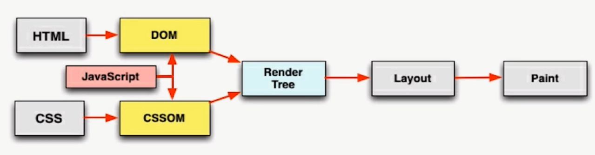

# 前端性能优化

> web前端的架构为B/S架构。	是将代码发送到 远程服务器和远程CDN上，动态地去加载静态资源的过程。

**前端优化的考虑点**

- `DNS` 通过缓存减少`DNS`查询时间
- 网络请求的过程走最近的网络环境
- 相同的静态资源缓存
- 减少请求HTTP请求大小
- 减少HTTP请求
- 服务端渲染 (使用框架需要走 相关框架代码才能在浏览器中渲染页面，会出现性能损耗)

## 资源合并与压缩

> 优化要点
>
> - 减少`http`请求数量
> - 减少请求资源的大小
>
> `html`压缩 | `css`压缩 | `js`压缩与混淆 | 文件合并 | 开启`gzip`

**HTML压缩**

> 压缩在文本文件中有意义，但在HTML中不显示的字符，包括空格、制表符、换行符等等。HTML注释也可以被压缩

**如何进行压缩**

- `nodejs` 提供 `html-minifier` 工具
- 后端模板引擎渲染压缩

**`CSS`压缩**

> 无效代码删除 、 `css`语义合并

**如何进行压缩**

- `html-minifier` 对`html`中的`css`进行压缩
- `clean-css` 对`css` 进行压缩

**`js`压缩与混乱**

> 无效字符的删除 、 剔除注释 、 代码语义的缩减和优化 、 代码保护

- `html-minifier` 对`html`中的`js`进行压缩
- 使用 `uglifyjs2 `对` js` 进行压缩

**文件合并**

**为什么使用文件合并？**

- 文件与文件之间有插入的上行请求，增加了N-1个网络延迟
- 受丢包问题影响更严重
- 经过代理服务器时可能会被断开

**文件合并存在的问题**

- 首屏渲染的问题
- 缓存失效的问题

**文件合并的建议**

- 公共库的合并
- 不同页面的合并
- 见机行事，随机应变

fis3 的运行流程

获取所有文件的依赖树，建立一个整体的依赖关系

然后对单文件会进行单文件的编译

单文件编译完成后会对定义的打包规则 来进行打包的升级，从而完成打包的过程

整体分为两部分：一部分是单文件的编译，一部分是打包的过程

## 图片相关优化

**`png8`/`png24`/`png32` 之间的区别**

- `png8`	256色，支持透明
- `png24`	2^24色，不支持透明
- `png32`	2^24色，支持透明

**不同格式图片常用的业务场景**

- `jpg`有损压缩，压缩率高，不支持透明【不需要透明图片】
- `png`支持透明，浏览器兼容好【需要透明图片】
- `webp`压缩程度更好，在 `ios`\ `webview`有兼容性问题【安卓】
- `svg`矢量图，代码内嵌，相对较小【图片样式相对较小 logo/icon】

### 图片压缩

- 针对真实图片情况，舍弃一些相对无关紧要的色彩信息
- `css` 雪碧图
- `image inline` 将图片内容内嵌到`html`中,使用`base64`的格式，减少`http`请求数量
- 使用矢量图
  - `SVG`进行矢量图的绘制
  - `iconfont`解决`icon`问题
- 安卓下使用`webp`

## `css`与`js`的装载与执行

**`html`页面加载渲染过程**

**`html`渲染过程特点**

- 顺序执行、并发加载
- 是否阻塞
- 依赖关系
- 引入方式

**顺序执行、并发加载**

**`css`阻塞**

- `css` `head` 中阻塞页面的渲染
  - head中对 link 引入阻塞页面的渲染，避免页面闪动
- `css` 阻塞`js`的执行
  - `js`执行可能会依赖某些`css`的属性
- `css` 不阻塞外部脚本的加载
  - 预资源加载器，不会堵塞加载的过程，会堵塞执行的过程

`js`**阻塞**

- 直接引入`js` 阻塞页面的渲染
  - `js` 可能会去修改DOM结构，`parser`会觉得`js`会影响后面DOM结构变化，则会造成阻塞
- `js`不阻塞资源的加载
  - 预资源加载器，暂停 `js` 的执行去预加载资源
- `js`顺序执行，阻塞后续`js`逻辑的执行
  - 浏览器来说 `js` 的执行是单线程的

**依赖关系**

- 页面渲染依赖于`css`的加载
- `js`执行顺序的依赖关系
- `js`逻辑对于DOM节点的依赖关系

`js`引入方式

- 直接引入
- defer
- async
- 异步动态引入js

### 优化点

- `css`样式表置顶
- 用 `link` 代替 `import`
- `js`脚本置底
- 合理使用`js`的异步加载能力

## 懒加载和预加载

**懒加载**

- 图片进入可视化区域之后请求图片资源
- 对于电商等图片很多，页面很长的业务场景适用
- 减少无效资源的加载
- 并发加载的资源过多会阻塞js的加载，影响网站的正常使用

**预加载**

- 图片等静态资源在使用之前的提前请求
- 资源使用到时能从缓存中加载，提高用户体验
- 页面展示的依赖关系维护
- 对于九宫格抽奖

### 原理

**懒加载：**

当我们的图片进入可视区域去请求资源

需要去监听 scroll事件，在scroll事件的回调中，去判断我们的懒加载的图片是否进入可视区域

`img` 的 `src` 本身是没有值的，出现在可视化区域后引入值

`lazyload` 有一个占位 ： 图片的大小在图片还未加载 之前就确定下来

**预加载：**

- `style:"display: none"`
- 使用`Image`对象
- 使用`XMLHttpRequest`对象
  - 存在跨域问题，但能更清晰的监控预加载过程

## 重绘与回流

> `css`性能会让JavaScript 变慢嘛？
>
> 一个线程进行JavaScript解析，一个线程进行`UI`渲染。
>
> 但由于浏览器的机制问题，因为JavaScript可能会在代码获取到 渲染后的结果，`css`核心会影响页面的展示，渲染的流程频繁的触发，即频繁触发 重绘和回流，会导致`UI`i频繁渲染，最终导致js 变慢

**回流**

当` render tree`中的一部分(或全部)因为元素的规模尺寸，布局，隐藏等改变而需要重新构建，这就称为回流(`reflow`)

当页面布局和几何属性改变时就需要回流

回流的代价 很大，应该减少 改变`css`属性触发回流的状态

**重绘**

当`render tree`中的一些元素需要更新属性，而这些属性只是影响元素的外观，风格，而**不影响布局**。比如`backgtound-color`。称为重绘

回流必定会引起重绘，重绘不一定引起回流。

**触发页面重布局的属性**

- 盒子模型相关属性会触发重布局
- 定位属性及浮动会触发重布局
- 改变节点内部文字结构会触发重布局

**只触发重绘的属性**

- color
- border-style
- ...

### 避免重绘回流的两种方法

1. 避免能使用触发重绘回流的`css`属性
2. 将重绘回流的影响范围限制在 单独的图层之内

**新建DOM的过程**

1. 获取DOM 后分隔为多个图层
2. 对每个图层的节点计算样式结果(Recalculate style -- 样式重计算)
3. 为每个节点生成图形和位置(layout -- 回流和重布局)
4. 将每个节点绘制填充到图层位图中(paint setup和paint -- 重绘)
5. 图层作为纹理上传至`GPU`
6. 符合多个图层到页面上生成最终屏幕图像(composite layers -- 图层重组)

所以可以将 频繁重绘回流的DOM元素单独作为一个 独立图层，那么这个DOM元素的重绘和回流的影响只会在这个图层中

- 缺点：图层过多时`GPU`计算 会影响性能

**如何将DOM元素变为 新的独立图层?**

Chrome创建图层的条件

1. 3D或透视变换CSS属性
2. 使用加速视频解码的<video> 节点
3. 拥有3D(WebGL)上下文或加速的2D上下文的<canvas>节点
4. 混合插件(Flash...)
5. opacity做css动画或使用一个动画webkit变换的元素
6. 拥有加速css过滤器的元素
7. 元素有一个包含复合层的后代节点
8. 元素有一个z-index较低且包含一个复合层的兄弟元素

### 实战优化点

- 用`translate` 替代 `top` 改变
- 用`opacity` 替代 `visibility`
- 不要一条一条地修改DOM样式，预先定义好class，然后修改DOM 的`className` 【修改DOM样式会触发重绘】
- 把DOM离线后修改。先将DOM 给`display:none`(有一次reflow)，修改后再显示出来
- 不要把DOM节点的属性值放在一个循环里面当作循环里的变量
- 不要使用table布局，可能很小的一个改变会造成整个table的重新布局
- 动画实现的速度的选择
- 对于动画新建图层
- 启动`GPU`硬件加速

## 浏览器存储

### cookie

> 维护用户状态 | 存储客户端的信息(存储大小4kb左右，需要设置过期时间expires)
>
> `httponly` 不允许 `js` 去读写
>
> 服务端生成，客户端存储和维护 

**生成方式** 

- http response headers 中的 set-cookie
- js 中可以通过 document.cookie 可以读写 cookie

cookie 是 一个域名维度 下的概念，域名下面的所有请求都会携带cookie，但有些域名下不需要用到cookie。

- 解决方法：CDN的域名 和主站的域名 要分开

### localstorage

> cookie存储能力被localstorage替代
>
> 大小为5M左右 | 仅在客户端使用，不与服务端进行通信 | 接口封装较好 | 浏览器本地缓存方案

### sessionstorage

> 会话级别的浏览器存储
>
> 大小为5M左右 | 仅在客户端使用，不与服务端进行通信 | 接口封装较好 | 对于表单信息的维护

### indexedDB

> 虽然webstorage对存储较少的数据很有用，但对于存储更大量的结构化数据这个方法不太管用。
>
> 低级API，用于客户端存储大量结构化数据
>
> 通过索引来实现对该数据的高性能搜索。
>
> 为应用创建离线版本

### service workers

> - workers在后台其他线程中处理并将结果返回到主线程中，这样避免 主线程的 阻塞情况，大大提高了 处理大规模js 运算的能力。
> - 是一个脚本，浏览器独立于当前网页，将其在后台运行。为实现一些不依赖页面或者用户交互的特性打开一扇大门。推出后的第一个首要的特性就是拦截和处理网络请求的能力，以编程方式来管理被缓存的响应。

即

- 使用拦截和处理网络请求的能力去实现一个离线应用
- 在后台运行同时能和页面通信的能力，去实现大规模后台数据的处理

拦截请求得到的资源存储到缓存中去`Cache Storage`

以后去读取资源会先在缓存中读取，而不会去网络读取

### PWA

> 渐进式的Web App，通过一系列新的web特性，配合优秀的UI交互设计，逐步增强Web App的用户体验

- 可靠: 在没有网络的情况下也能提供基本的页面访问，而不是出现 "未连接到互联网的页面"
- 快速: 针对网页渲染及网络数据访问有较好的优化
- 融入: 应用可以被增加到手机桌面，并且和普通应用一样有全屏，推送等特性

## 缓存

`httpheader`

### `Cache-Control`

- `max-age`
  - 从请求资源到这段时间之内浏览器再次请求该资源时是不会向服务端发起请求的
- `s-maxage`
  - 优先级高于max-age
  - 只能指定 public 的缓存，不是去从浏览器去拿，而是去CDN去拿
- private
- public
- no-cache
  - 不会去浏览器中读相关的缓存，发请求到服务端，通过服务端的信息去进一步判断当前浏览器的缓存有没有过期，从而来知道缓存策略是怎样的。
- no-store
  - 对该文件 不适用任何的 缓存策略

`Expires`

> 缓存过期时间，用来指定资源到期时间，是服务器端的具体的时间点
>
> 告诉浏览器在过期时间前浏览器可以直接从浏览器缓存中取数据而无需再次请求

- `max-age`的优先级 高于 `Expires`的优先级

### last-modified / if-modified-since

> 数据及时更新，感知数据的变化

> 基于 客户端和服务端协商的缓存机制
>
> - last-modified --- response header
> - if-modified-since --- request header

需要与`cache-control` 共同使用

**last-modified的缺点**

- 某些服务器端不能获取精确的修改时间
- 文件修改时间改了，但文件内容却没有变

### etag / if-none-match

> 解决 last-modified 的缺点 

> 文件内容的hash值 match上就是缓存文件内容无变化
>
> - etag --- response header
> - if-none-match --- request header

需要与`cache-control` 共同使用

### 分级缓存策略

200状态

- 当浏览器本地没有缓存或者下一层失效时，或者用户点击了CTRL+F5时，浏览器直接去服务器下载最新数据

304状态

- 这一层由last-modified/etag 控制。当下一层失效或者用户点击refresh，F5时，浏览器就会发送请求给服务器，如果服务器没有变化，则返回304给浏览器

200状态(from cache)

- 这一层由expires/cache-control控制。两者同时存在时cache-control会覆盖expires。只要没有失效，l浏览器只访问自己的缓存

